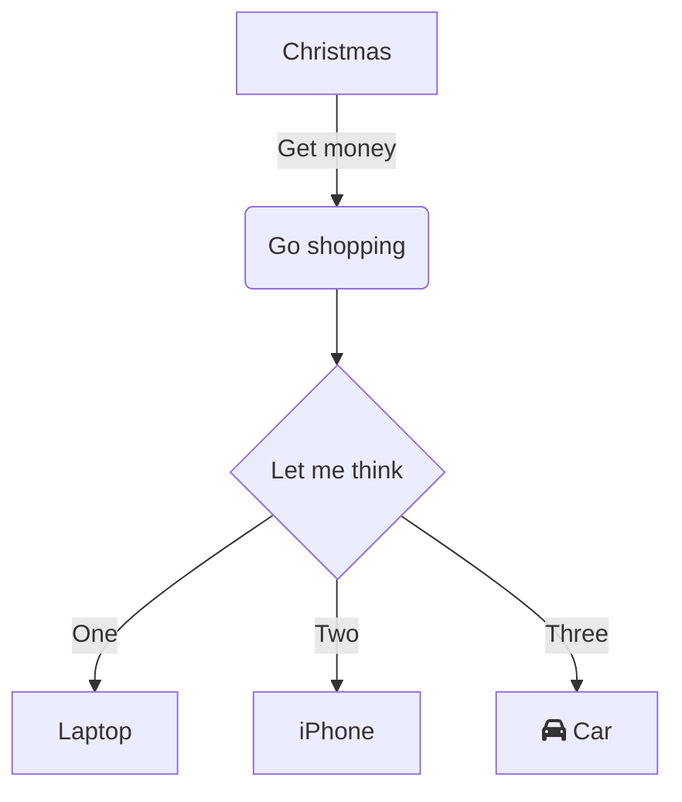

## 准备




### 本源码需要配合Clion使用,keil等代码编辑器可能存在语法错误 

代码中注释了部分功能,可以自行尝试


### 环境配置

1. 下载安装Clion

2. 安装 PlatformIO 插件

3. 在clion中新建一个项目，根据提示配置环境

4. 编写一个简单的代码测试环境是否配置成功

```c
#include <mcs51/8052.h>

void main()

{
    while(1)
    {
        P1 = 0xfe;
    }
}
```

### 环境配置文件(以stc89c52rc为例)

```json
[env:STC89C52RC]
platform = intel_mcs51
board = STC89C52RC

lib_deps = C:\Users\Night\.platformio\packages\toolchain-sdcc\include 
// 这里配置环境安装路径
```


## 原理图

### led电路图


#### 蜂鸣器


#### 7Ch138译码器


#### 或非门


#### 数码管

## 延时函数

```c
// 延时函数
void Delay(unsigned int time) {
  while (time--) {
    DisplaySMG_Dynamic();
  }
}

// 延时函数
void DelaySMG(unsigned int time) {
  while (time--)
    ;
}
```

## 定时器函数

```c
// Timer 0 interrupt service routine
void timer0_ISR() __interrupt(1) {
    TH0 = 0xFC; // Reload high byte for 1ms
    TL0 = 0x66; // Reload low byte for 1ms
    }
}

// Initialize Timer 0
void Timer0_Init() {
    TMOD |= 0x01; // Set Timer 0 in mode 1 (16-bit timer mode)
    TH0 = 0xFC;   // Load initial value for 1ms delay
    TL0 = 0x66;
    ET0 = 1;      // Enable Timer 0 interrupt
    EA = 1;       // Enable global interrupts
    TR0 = 1;      // Start Timer 0
}
```
## 数码管位选和段选函数
    
 ```c
// 选择位
void SelectBit(unsigned char pos) {
  Init74HC138(6); // Open COM end
  P0 = 0x00;      // Turn off all segments
  DelaySMG(10);   // Short delay to eliminate shadow
  P0 = (0x01 << pos);
}

// 选择段
void SelectSegment(unsigned char value) {
  Init74HC138(7); // 打开段选端
  P0 = value;
}

```

## 74HC573锁存器函数

```c
void int74h573(unsigned int n) {
  switch (n) {
  case 4:
    P2 = (P2 & 0x1f) | 0x80;
    break;
  case 5:
    P2 = (P2 & 0x1f) | 0xa0;
    break;
  case 6:
    P2 = (P2 & 0x1f) | 0xc0;
    break;
  case 7:
    P2 = (P2 & 0x1f) | 0xe0;
    break;
  }
}

```

##  动态显示数码管
```c
// 动态显示数码管
void DisplaySMG_Dynamic() {
  SelectBit(0);
  SelectSegment(SMG_NoDot[hour / 10]);
  DelaySMG(500);

  SelectBit(1);
  SelectSegment(SMG_NoDot[hour % 10]);
  DelaySMG(500);

  SelectBit(2);
  SelectSegment(SMG_NoDot[16]);
  DelaySMG(500);

  SelectBit(3);
  SelectSegment(SMG_NoDot[minute / 10]);
  DelaySMG(500);

  SelectBit(4);
  SelectSegment(SMG_NoDot[minute % 10]);
  DelaySMG(500);

  SelectBit(5);
  SelectSegment(SMG_NoDot[16]);
  DelaySMG(500);

  SelectBit(6);
  SelectSegment(SMG_NoDot[second / 10]);
  DelaySMG(500);

  SelectBit(7);
  SelectSegment(SMG_NoDot[second % 10]);
  DelaySMG(500);
}

```

## 完整代码 mian.c

```c
#include "mcs51/8052.h"
#include "tool.h"

typedef unsigned int u16;
unsigned int ms_count = 0; // Millisecond counter

// Timer 0 interrupt service routine
void timer0_ISR() __interrupt(1) {
  TH0 = 0xFC; // Reload high byte for 1ms
  TL0 = 0x66; // Reload low byte for 1ms
  ms_count++;
  if (ms_count >= 1000) { // 1000ms = 1 second
    ms_count = 0;
    time_increase();
    DisplaySMG_Dynamic();
  }
}

// Initialize Timer 0
void Timer0_Init() {
  TMOD |= 0x01; // Set Timer 0 in mode 1 (16-bit timer mode)
  TH0 = 0xFC;   // Load initial value for 1ms delay
  TL0 = 0x66;
  ET0 = 1;      // Enable Timer 0 interrupt
  EA = 1;       // Enable global interrupts
  TR0 = 1;      // Start Timer 0
}


// Main function
int main() {
    Timer0_Init(); // Initialize Timer 0
    while (1) {
        DisplaySMG_Dynamic(); // Display dynamic SMG
    }
}
```

## tool.h

```c
//
// Created by NightRain on 2024/11/18.
//

#ifndef UNTITLED1_TOOL_H
#define UNTITLED1_TOOL_H

void DisplaySMG_Dynamic();
void Delay(unsigned int time);
void DelaySMG(unsigned int time);
void Init74HC138(unsigned char n);
void SelectBit(unsigned char pos);
void SelectSegment(unsigned char value);
void time_increase();
#endif // UNTITLED1_TOOL_H
```

## tool.c

```c
//
// Created by NightRain on 2024/11/18.
//

#include "tool.h"
#include "mcs51/8052.h"

// 共阳4位数码管的段码数组
unsigned char SMG_NoDot[18] = {0xc0, 0xf9, 0xa4, 0xb0, 0x99, 0x92,
                               0x82, 0xf8, 0x80, 0x90, 0x88, 0x80,
                               0xc6, 0xc0, 0x86, 0x8e, 0xbf, 0x7f};

unsigned int hour = 0;
unsigned int minute = 0;
unsigned int second = 0;

void DisplaySMG_Dynamic();
void Delay(unsigned int time);
void DelaySMG(unsigned int time);
void Init74HC138(unsigned char n);
void SelectBit(unsigned char pos);
void SelectSegment(unsigned char value);

// 延时函数
void Delay(unsigned int time) {
  while (time--) {
    DisplaySMG_Dynamic();
  }
}

// 延时函数
void DelaySMG(unsigned int time) {
  while (time--)
    ;
}

// 选择通道，即具体选择哪个锁存器
void Init74HC138(unsigned char n) {
  switch (n) {
  case 4:
    P2 = (P2 & 0x1f) | 0x80;
    break;
  case 5:
    P2 = (P2 & 0x1f) | 0xa0;
    break;
  case 6:
    P2 = (P2 & 0x1f) | 0xc0;
    break;
  case 7:
    P2 = (P2 & 0x1f) | 0xe0;
    break;
  }
}

void int74h573(unsigned int n) {
  switch (n) {
  case 4:
    P2 = (P2 & 0x1f) | 0x80;
    break;
  case 5:
    P2 = (P2 & 0x1f) | 0xa0;
    break;
  case 6:
    P2 = (P2 & 0x1f) | 0xc0;
    break;
  case 7:
    P2 = (P2 & 0x1f) | 0xe0;
    break;
  }
}

// 选择位
void SelectBit(unsigned char pos) {
  Init74HC138(6); // Open COM end
  P0 = 0x00;      // Turn off all segments
  DelaySMG(10);   // Short delay to eliminate shadow
  P0 = (0x01 << pos);
}

// 选择段
void SelectSegment(unsigned char value) {
  Init74HC138(7); // 打开段选端
  P0 = value;
}

void time_increase() {
  second++;
  if (second == 60) {
    second = 0;
    minute++;
    if (minute == 60) {
      minute = 0;
      hour++;
      if (hour == 24) {
        hour = 0;
      }
    }
  }
}

// 动态显示数码管
void DisplaySMG_Dynamic() {
  SelectBit(0);
  SelectSegment(SMG_NoDot[hour / 10]);
  DelaySMG(500);

  SelectBit(1);
  SelectSegment(SMG_NoDot[hour % 10]);
  DelaySMG(500);

  SelectBit(2);
  SelectSegment(SMG_NoDot[16]);
  DelaySMG(500);

  SelectBit(3);
  SelectSegment(SMG_NoDot[minute / 10]);
  DelaySMG(500);

  SelectBit(4);
  SelectSegment(SMG_NoDot[minute % 10]);
  DelaySMG(500);

  SelectBit(5);
  SelectSegment(SMG_NoDot[16]);
  DelaySMG(500);

  SelectBit(6);
  SelectSegment(SMG_NoDot[second / 10]);
  DelaySMG(500);

  SelectBit(7);
  SelectSegment(SMG_NoDot[second % 10]);
  DelaySMG(500);
}
```